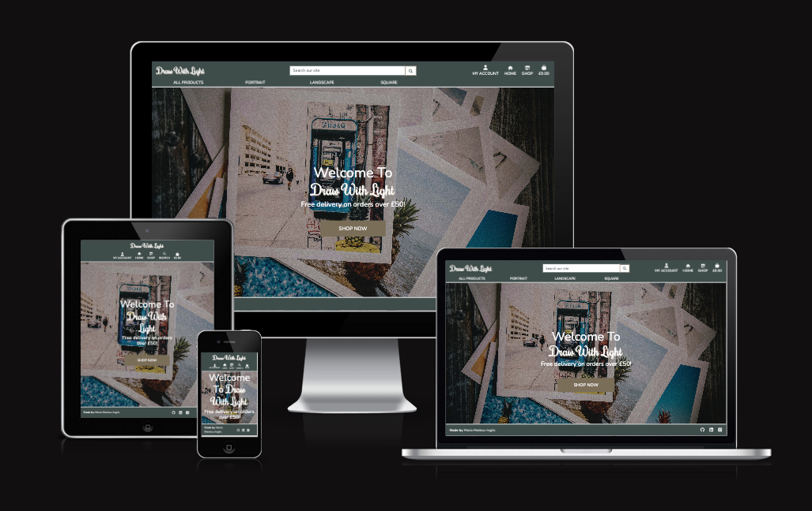
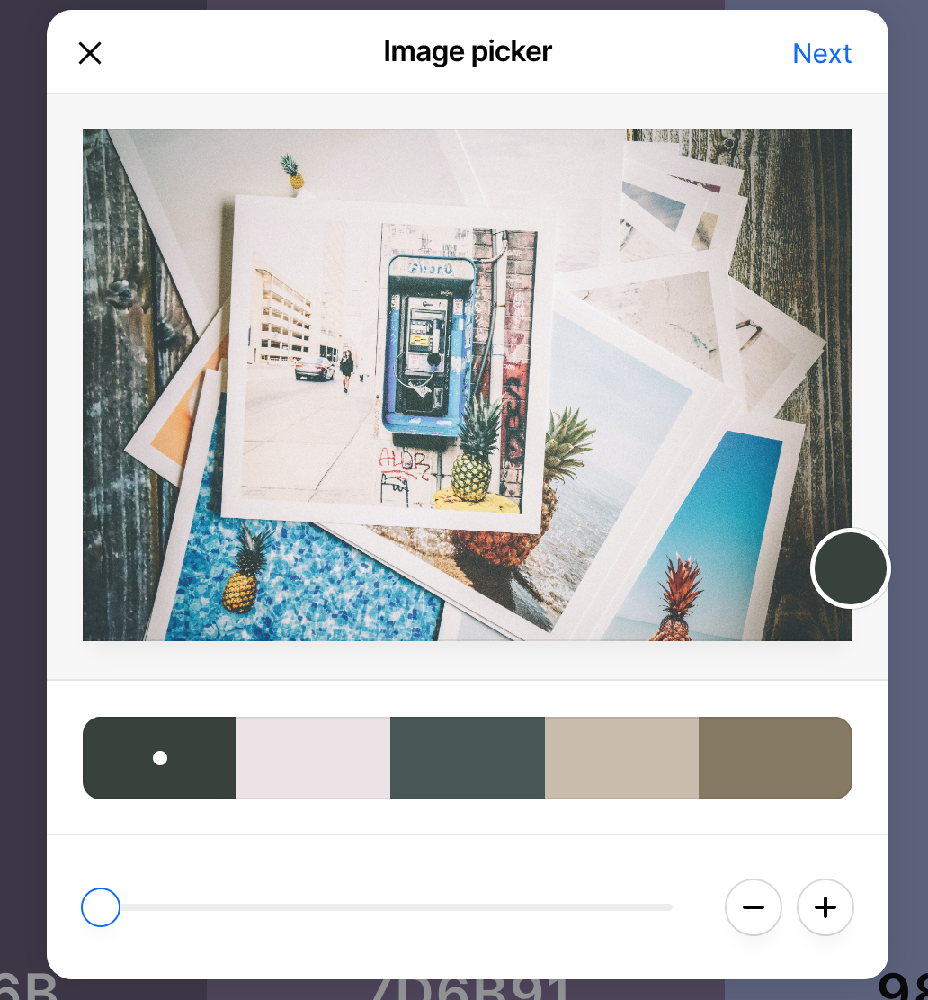
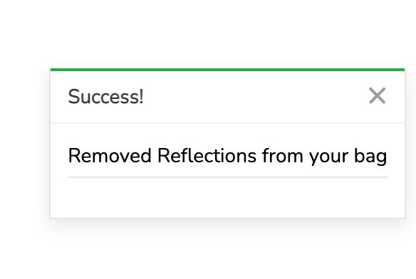
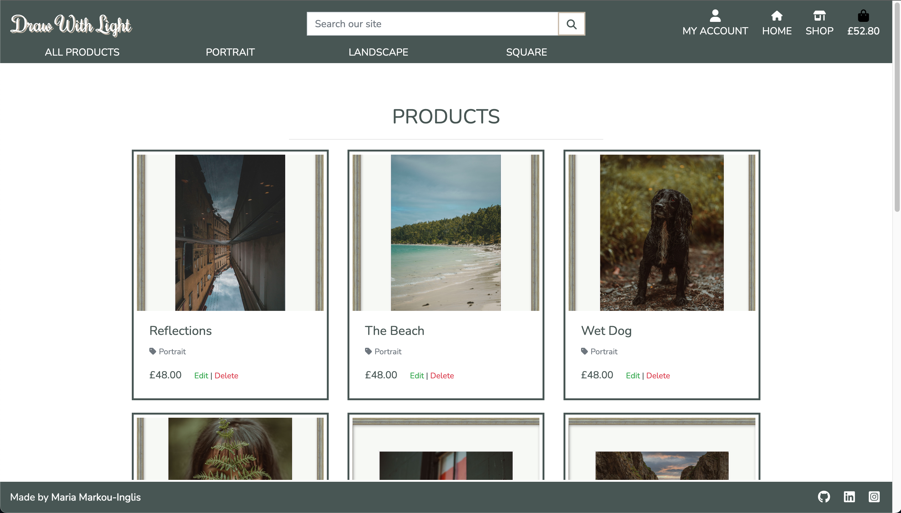
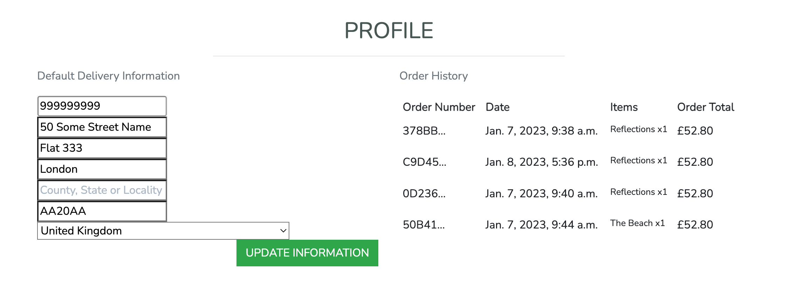
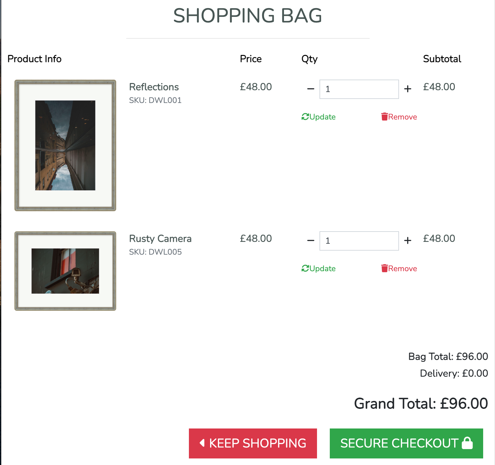
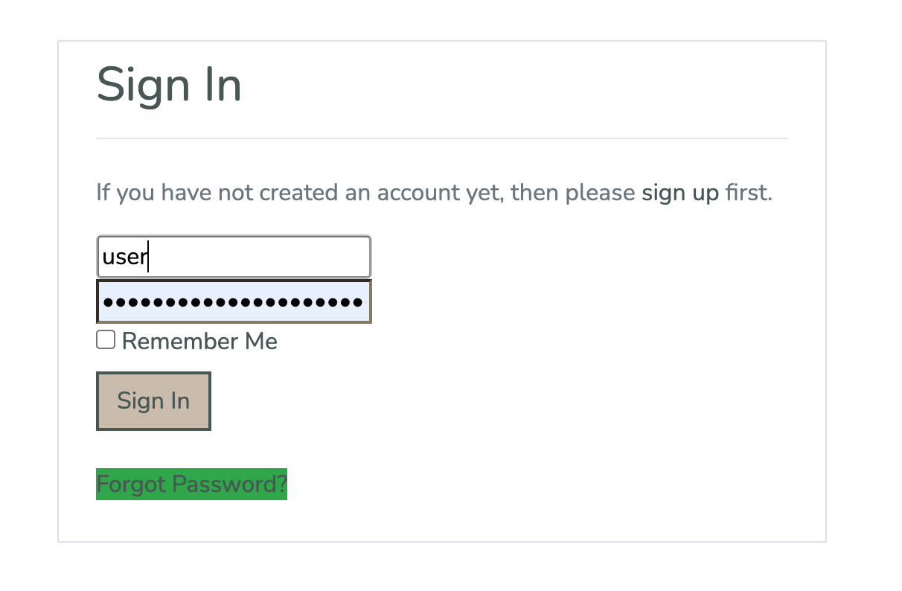
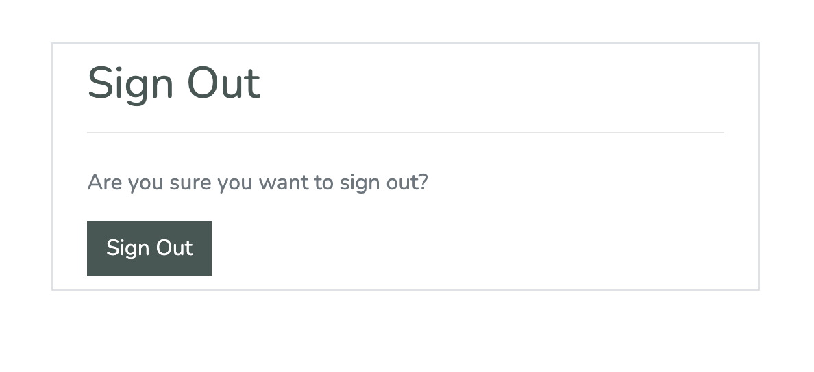
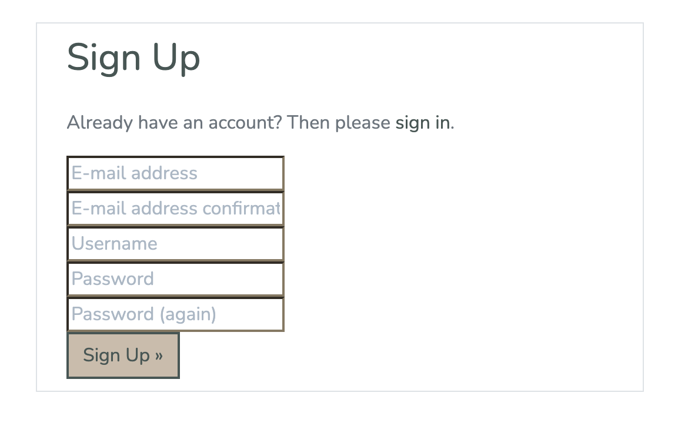
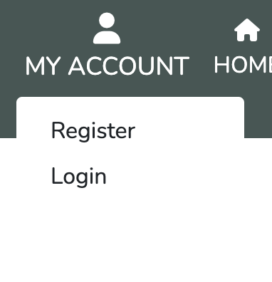

# [Draw with light](https://draw-with-light.herokuapp.com)


Draw with Light is a Full-Stack e-commerce website built using Django, Python, HTML, CSS and JavaScript. The website utilises Stripe as the payment processor.

You can find the deployed link [here](https://draw-with-light.herokuapp.com)


This site is for training purposes only, the company is fictional and no orders will be charged or products delivered

---

## Table of contents

- [Draw with light](#draw-with-light)
  - [Table of contents](#table-of-contents)
  - [UX Design](#ux-design)
    - [Project Goals](#project-goals)
    - [User Stories](#user-stories)
    - [Wireframes](#wireframes)
    - [Database schema](#database-schema)
    - [Style and colours](#style-and-colours)
  - [Features](#features)
    - [Future Implementations](#future-implementations)
  - [Technologies Used](#technologies-used)
  - [Testing](#testing)
  - [Deployment](#deployment)
    - [Create the Database](#create-the-database)
    - [Create a new Heroku app](#create-a-new-heroku-app)
    - [Project preparation in Gitpod](#project-preparation-in-gitpod)
    - [Generate a SECRET\_KEY \& Updating Debug](#generate-a-secret_key--updating-debug)
    - [Set up AWS hosting for static and media files](#set-up-aws-hosting-for-static-and-media-files)
    - [Creating AWS groups, policies and users](#creating-aws-groups-policies-and-users)
    - [Connecting Django to our S3 bucket](#connecting-django-to-our-s3-bucket)
    - [Setting up Stripe](#setting-up-stripe)
  - [Credits](#credits)
    - [Content](#content)
    - [Acknowledgements](#acknowledgements)

---

## UX Design

  ---
  ### Project Goals
  Draw with Light is a Business to Customer (B2C) e-commerce site.
  The owner's goal is to create a website where they can sell prints of the photographs they have taken and generate income. 
  The target audience is people who love photography and want to decorate their house with it. Customers have the option to buy printed photographs which they can frame and hang on their walls.

  ### User Stories
  - #### VIEWING & NAVIGATION
      | User Story Id 	| As a    	| I want to be able to...         	| So that I can...                                                                     	|
      |---------------	|---------	|---------------------------------	|--------------------------------------------------------------------------------------	|
      | 1             	| Shopper 	| Easily navigate the site        	| Find products and information that I require                                         	|
      | 2             	| Shopper 	| View products by category       	| Find specific items I am interested in without having to scroll through all products 	|
      | 3             	| Shopper 	| View details of each product    	| Learn more about each product                                                        	|
      | 4             	| Shopper 	| View the items I have in my bag 	| Check whether I still wish to purchase the items and amend the quantity if required  	|

    - #### REGISTRATION & USER ACCOUNTS
        | User Story ID 	| As a    	| I want to be able to ...                    	| So that I can...                                        	|
        |---------------	|---------	|---------------------------------------------	|---------------------------------------------------------	|
        | 1             	| Shopper 	| Register an account                         	| Have an account with the site and view my profile       	|
        | 2             	| Shopper 	| Receive an email to confirm my registration 	| Verify my account was created successfully              	|
        | 3             	| Shopper 	| Log in and out                              	| Keep my account information secure                      	|
        | 4             	| Shopper 	| View a profile page                         	| Set a default delivery address and view previous orders 	|
        | 5             	| Shopper 	| Reset my password                           	| Recover my account                                      	|

    - #### SORTING AND SEARCHING
        | User Story ID 	| As a    	| I want to be able to...                     	| So that I can...                             	|
        |---------------	|---------	|---------------------------------------------	|----------------------------------------------	|
        | 1             	| Shopper 	| Search for a product by name or description 	| Find a specific product I'd like to purchase 	|
        | 2             	| Shopper 	| Find products from a specific category      	| Only see product from that category          	|

    - #### PURCHASING & CHECKOUT
        | User Story ID 	| As a    	| I want to be able to...                                    	| So that I can...                                                                        	|
        |---------------	|---------	|------------------------------------------------------------	|-----------------------------------------------------------------------------------------	|
        | 1             	| Shopper 	| Easily select the quantity of a product when purchasing it 	| Ensure I don't accidentally select the wrong product quantity                           	|
        | 2             	| Shopper 	| View all items in my bag                                   	| Make sure I haven't accidentally added the wrong product in my bag                      	|
        | 3             	| Shopper 	| Adjust the quantity of individual items in my bag          	| Easily make changes to my purchase before checkout                                      	|
        | 4             	| Shopper 	| Easily enter my payment information                        	| Check out quickly and with no hassles                                                   	|
        | 5             	| Shopper 	| Save all address info                                      	| I don't have to enter them again on my next order                                       	|
        | 6             	| Shopper 	| View an order confirmation after checkout                  	| Make sure my order was successfully placed and double check that all detail are correct 	|
        | 7             	| Shopper 	| Save all orders on my Profile                              	| Easily access all orders anytime                                                       	|
        | 8             	| Shopper 	| Receive an email confirmation after checking out           	| Keep the confirmation of what I've purchased for my records                             	|

    - #### ADMIN & STORE MANAGEMENT
      | User Story ID 	| As a              	| I want to be able to... 	| So that I can...                         	|
      |---------------	|-------------------	|-------------------------	|------------------------------------------	|
      | 1             	| Store Owner/Admin 	| Add a product           	| Add new items to my store                	|
      | 2             	| Store Owner/Admin 	| Edit a product          	| Update product details                   	|
      | 3             	| Store Owner/Admin 	| Delete a product        	| Remove items that are no longer for sale 	|
  [Back to top](#Table-of-contents)

  ---

  ### Wireframes
  - [Home Page](wireframes/wireframe_home.png)
  - [Products](wireframes/wireframe_products.png)
  - [Product Details](wireframes/product-details.png)
  - [Profile](wireframes/profile.png)
  - [Shopping Bag](wireframes/shopping-bag.png) 

  [Back to top](#Table-of-contents)

  ---

  ### Database schema
  
  The site uses five models as shone above:
  - User 
  - Order 
  - Order Line Item
  - Product 
  - Category

  [Back to top](#Table-of-contents)

  ---

  ### Style and colours

After creating the wireframes and main structure of the home page, I needed some inspiration for the style and colour. I sourced an [image](https://www.pexels.com/photo/pile-of-assorted-photos-191429/) that I could use as the background image for the home page. Then I headed to [coolors.co](https://coolors.co/) and use the "create palette from photo" function. I uploaded the image and played around to find a palette I liked.

I ended up only using the green colours with white to create contrast and make all text easy to read.

The website used two fonts, Rochester for the logo and Nunito for the rest on the site

[Back to top](#Table-of-contents)

---

## Features
  - **Favicon**
    I used [Favivon.io](https://favicon.io/) to create the favicon for the site. I have used the initials of the site to create the favicon and the same font and colours from the site.
    
  -  **Navigation Bar**
    The navigation bar changed based on the size of the screen used.
      
      
  -  **Footer**
         
  -  **Messages - Toasts**  
    This site uses django's messages framework to provide users with helpful feedback at multiple points through their journey in the form of toasts.
    
  -  **Home Page**
    When users land on the home page, they see a welcome message. Under they welcome message they can find what offer is on at the moment and a shop button so that they can view all products with one click
       
  -  **Products Page**
    The product page contains cards for each product. Users can find the name, category and price of the product. Superusers can also find a delete and edit button on the cards  
    
    -  **Profile Page**
    On the profile page, users can save their delivery information so that they do not have to enter them every time they place and order. They can also view a list with all the orders they have placed.
    
    -  **Bag Page**
    On the bag page users can find a list of all items added to their bag. The product name, price, sku, quantity and subtotal is displayed for each product. Users can also update the quantity and remove and item from their bag. They can also find out the bag total, delivery cost (when applicable) and grand total. If they are happy with their order they can click on the secure checkout button. A "keep shopping" button is located at the bottom of the page that takes the user back to products.
    
    -  **Checkout**
    Users need fill in their full name, email, delivery info and card details to pay and place the order. They can also see an order summary on that page including the order total, delivery fee (when applicable) and grand total 
    -  **Product Management for Admin**
    When a superuser is logged in they can find a product management option on the account dropdown. This takes them to the "add product page" where they can fill in a form and add a new product on the website
    -  **Register/Login/Logout**
    Users can  find all the links they need to register, login and logout by clicking on the account icon on the navigation bar.
    
    
    
    
    
  [Back to top](#Table-of-contents)

  ---

  ### Future Implementations
  - #### In future implementations I would like to:
    - **Add Wishlist functionality**: Allow users to save all their favorite prints so that it is easier to find them when they revisit the website.
    - **Add user reviews**: Allow users to review products and share photos of how the used the print to decorate their space.
    - **Send newsletters to users**: Give all users the option to sign up to the newsletter and keep them updated on the latest offers.
    - **Allow coupons to be accepted in the checkout**: This is a way to increase sales by offering discounted price to customers. For example offering a discount to a registered user that has not placed any orders to motivate them or reward a repeated customer.
    - **Subscription**: Give users the option to subscribe, paying a monthly fee and getting a free print every month.
    - **Implement Social login/register**: Give users the option to register and login using their social accounts.

[Back to top](#Table-of-contents)

---

## Technologies Used
- Languages Used
  - [HTML](https://en.wikipedia.org/wiki/HTML) 
  - [CSS](https://en.wikipedia.org/wiki/CSS) 
  - [Javascript](https://www.javascript.com/) 
- Frameworks Used
  - [Django](https://www.djangoproject.com/) - used to simplify development   
  - [Bootsrap](https://getbootstrap.com/) - used for styling and responsiveness 
- Database Used
  - [sqlite3](https://docs.python.org/3/library/sqlite3.html) - used for development
  - [ElephantSQL](https://www.elephantsql.com/) - used for deployment
- Libraries & Packages Used
  - [Django-Allauth](https://django-allauth.readthedocs.io/en/latest/installation.html) -  used to simplify user authentication, registration, account management
  - [Font Awesome](https://fontawesome.com/) - used for all the icons on the site
  - [django-countries](https://pypi.org/project/django-countries/) - dropdown list of countries used on checkout
  - [django_crispy_forms](https://pypi.org/project/django-crispy-forms/) - provides a tag and filter that lets you quickly render forms
  - [gunicorn](https://pypi.org/project/gunicorn/) - a Python WSGI HTTP Server
  - [pillow](https://pypi.org/project/Pillow/) - Python imaging library
  - [dj_databsae_url](https://pypi.org/project/dj-database-url/) - allows us to utilise the DATABASE_URL variable
  - [psycopg2](https://pypi.org/project/psycopg2/) - a postgres database adapter which allow us to connect with a postgres database
  - [django-storages](https://pypi.org/project/django-storages/) - a storage backend library
  - [boto3](https://pypi.org/project/boto3/) - Allows connection to AWS S3 bucket
- Stripe
  - [Stripe](https://stripe.com/gb) was used in the project to implement the payment system
- Programs Used
  - [Favicon](https://favicon.io/) used to create the favicon
  - [Git](https://git-scm.com/) - used for version control.
  - [GitHub](https://github.com/) - used o save and store the files for this project.
  - [Google Dev Tools](https://developer.chrome.com/docs/devtools/) - used to troubleshoot, test features and solve issues with responsiveness and styling.
  - [Lucidchart](https://lucid.app/) - used to create the database schema

[Back to top](#Table-of-contents)

---

## Testing
  Find more [here](TESTING.md)

---

## Deployment
The project is deployed on Heroku following the steps bellow:

### Create the Database
Sqlite3 was used in development but cannot be used for the deployed project. An ElephantSQL database was created following the steps bellow:
- Go to the ElephantSQL, create an account and log in and access your dashboard
- Click on the “Create New Instance” button
- Set up your plan
  - Give your plan a Name (this is commonly the name of the project)
  - Select the Tiny Turtle (Free) plan
  - You can leave the Tags field blank
- Select “Select Region”
- Select a data center near you
- Then click “Review”
- Check your details are correct and then click “Create instance”
- Return to the ElephantSQL dashboard and click on the database instance name for this project
- In the URL section, clicking the copy icon will copy the database URL to your clipboard
### Create a new Heroku app
- Go to Heroku's website, create an account, login and click to create a new app
- Give your app a name and select the region closest to you. When you’re done, click Create app to confirm (must be a unique name)
- Open the Settings tab
- Add the config var DATABASE_URL, and for the value, copy in your database url from ElephantSQL. It should look something like this. Do not add quotation marks around your database url string.

### Project preparation in Gitpod
- In the terminal, install dj_database_url and psycopg2, both of these are needed to connect to your external database.
```
 pip3 install dj_database_url==0.5.0 psycopg2
```
- Update your requirements.txt file with the newly installed packages
```
 pip freeze > requirements.txt
```
- In your settings.py file, import dj_database_url underneath the import for os
```
 import os
 import dj_database_url
```
- Scroll to the DATABASES section and update it to the following code, so that the original connection to sqlite3 is commented out and we connect to the new ElephantSQL database instead. Paste in your ElephantSQL database URL in the position indicated
```
# DATABASES = {
 #     'default': {
 #         'ENGINE': 'django.db.backends.sqlite3',
 #         'NAME': os.path.join(BASE_DIR, 'db.sqlite3'),
 #     }
 # }
     
 DATABASES = {
     'default': dj_database_url.parse('your-database-url-here')
 }
```
DO NOT commit this file with your database string in the code, this is temporary so that we can connect to the new database and make migrations. We will remove it in a moment.

- In the terminal, run the showmigrations command to confirm you are connected to the external database
```  
python3 manage.py showmigrations
```
- Migrate your database models to your new database
``` 
 python3 manage.py migrate
```
- Load in the fixtures. Please note the order is very important here. We need to load categories first
```
 python3 manage.py loaddata categories
```
- Then products, as the products require a category to be set
```
python3 manage.py loaddata products
```
- Create a superuser for your new database
```  
python3 manage.py createsuperuser
```
- You should now be able to go to the browser tab on the left of the page in elephantSQL, click the table queries button and see the user you've just created by selecting the auth_user table.
- We can now add an if/else statement for the databases in settings.py, so we use the development database while in development (the code we commented out) - and the external database on the live site (note the change where the db URL was is now a variable we will use in Heroku):
```
if 'DATABASE_URL' in os.environ:
    DATABASES = {
      'default': dj_database_url.parse(os.environ.get('DATABASE_URL'))
    }
else:
    DATABASES = {
        'default': {
            'ENGINE': 'django.db.backends.sqlite3',
            'NAME': os.path.join(BASE_DIR, 'db.sqlite3')
      }
    }
```
- Install gunicorn which will act as our webserver and freeze this to the requirements.txt file:
```
pip3 install gunicorn
pip3 freeze > requirements.txt
```
- Create a Procfile in the root directory. This tells Heroku to create a web dyno which runs gunicorn and serves our django app. Add the following to the file (making sure not to leave any blank lines underneath):
```
web: gunicorn seaside_sewing.wsgi:application
```
- Log into the Heroku CLI in the terminal and then run the following command to disable collectstatic. This command tells Heroku not to collect static files when we deploy:
``` 
heroku config:set DISABLE_COLLECTSTATIC=1 --app heroku-app-name-here
```
- We will also need to add the Heroku app and localhost (which will allow gitpod to still work) to ALLOWED_HOSTS = [] in settings.py
```
ALLOWED_HOSTS = ['{heroku deployed site URL here}', 'localhost' ]
```
- Save, add, commit and push the changes to GitHub. You can then also initialize the Heroku git remote in the terminal and push to Heroku with:
```
heroku git:remote -a {app name here}
git push heroku master
```
- You should now be able to see the deployed site (without any static files as we haven't set these up yet).
- To enable automatic deploys on Heroku, go to the deploy tab and click the connect to GitHub button in the deployment method section. Search for the projects repository and then click connect. Click enable automatic deploys at the bottom of the page.
### Generate a SECRET_KEY & Updating Debug
- Django automatically sets a secret key when you create your project, however we shouldn't use this default key in our deployed version, as it leaves our site vulnerable. We can use a random key generator to create a new SECRET_KEY which we can then add to our Heroku config vars which will then keep the key protected.
- Create a new key and copy the value.
- In Heroku settings create a new config var with a key of SECRET_KEY. The value will be the secret key we just created. Click add.
- In settings.py we can now update the SECRET_KEY variable, asking it to get the secret key from the environment, or use an empty string in development:
```
SECRET_KEY = os.environ.get('SECRET_KEY', ' ')
```
- We can now adjust the DEBUG variable to only set DEBUG as true if in development:
```
DEBUG = 'DEVELOPMENT' in os.environ
```
- Save, add, commit and push these changes.

### Set up AWS hosting for static and media files
- Sign up or login to your aws amazon account on the top right by using the manage my account button and then navigate to S3 to create a new bucket.
- The bucket will be used to store our files, so it is a good idea to name this bucket the same as your project. Select the region closest to you. In the object ownership section we need to select ACLs enabled and then select bucket owner preferred. In the block public access section uncheck the block public access box. You will then need to tick the acknowledge button to make the bucket public. Click create bucket.
- Click the bucket you've just created and then select the properties tab at the top of the page. Find the static web hosting section and choose enable static web hosting, host a static website and enter index.html and error.html for the index and error documents (these won't actually be used.)
- Open the permissions tab and copy the ARN (amazon resource name). Navigate to the bucket policy section click edit and select policy generator. The policy type will be S3 bucket policy, we want to allow all principles by adding * to the input and the actions will be get object. Paste the ARN we copied from the last page into the ARN input and then click add statement. Click generate policy and copy the policy that displays in a new pop up. Paste this policy into the bucket policy editor and make the following changes: Add a /* at the end of the resource value. Click save.
- Next we need to edit the the cross-origin resource sharing (CORS). Paste in the following text:
```
[
    {
        "AllowedHeaders": [
            "Authorization"
        ],
        "AllowedMethods": [
            "GET"
        ],
        "AllowedOrigins": [
            "*"
        ],
        "ExposeHeaders": []
    }
]
```
- Now we need to edit the access control list (ACL) section. Click edit and enable list for everyone(public access) and accept the warning box.

### Creating AWS groups, policies and users
- Click the services icon on the top right of the page and navigate to IAM - manage access to AWS services. On the left hand navigation menu click user groups and then click the create group button in the top right. This will create the group that our user will be placed in.
- Choose a name for your group - for example manage-seaside-sewing, and click the create policy button on the right. This will open a new page.
- Click on the JSON tab and then click the link for import managed policy on the top right of the page.
- Search for S3 and select the one called AmazonS3FullAccess, then click import.
- We need to make a change to the resources, we need to make resources an array and then change the value for resources. Instead of a * which allows all access, we want to paste in our ARN. followed by a comma, and then paste the ARN in again on the next line with /* at the end. This allows all actions on our bucket, and all the resources in it.
- Click the next: tags button and then the next:review 
- Give the policy a name and description. Click the create policy button.
- Now we need to attach the policy we just created. On the left hand navigation menu click user groups, select the group and go to the permissions tab. Click the add permissions button on the right and choose attach policies from the dropdown.
- Select the policy you just created and then click add permissions at the bottom.
- Now we'll create a user for the group by clicking on the user link in the left hand navigation menu, clicking the add users button on the top right and giving our user a username. Select programamtic access and then click the next: permissions button.
- Add the user to the group you just created and then click next:tags button, next:review button and then create user button.
- You will now need to download the CSV file as this contains the user access key and secret access key that we need to insert into the Heroku config vars. Make sure you download the CSV now as you won't be able to access it again.

### Connecting Django to our S3 bucket
- Install boto3 and django storages and freeze them to the requirements.txt file.
```
pip3 install boto3
pip3 install django-storages
pip3 freeze > requirements.txt
```
- Add storages to the installed apps in settings.py
- Add the following code in settings.py to use our bucket if we are using the deployed site:
```
if 'USE_AWS' in os.environ:
    AWS_S3_OBJECT_PARAMETERS = {
        'Expires': 'Thu, 31 Dec 2099 20:00:00 GMT',
        'CacheControl': 'max-age=9460800',
    }
    
    AWS_STORAGE_BUCKET_NAME = 'enter your bucket name here'
    AWS_S3_REGION_NAME = 'enter the region you selected here'
    AWS_ACCESS_KEY_ID = os.environ.get('AWS_ACCESS_KEY_ID')
    AWS_SECRET_ACCESS_KEY = os.environ.get('AWS_SECRET_ACCESS_KEY')
    AWS_S3_CUSTOM_DOMAIN = f'{AWS_STORAGE_BUCKET_NAME}.s3.amazonaws.com'
```
- We can now go to Heroku and add the following config vars:
  - **AWS_ACCESS_KEY_ID** - *The access key value from the amazon csv file downloaded in the last section*
  - **AWS_SECRET_ACCESS_KEY** - *The secret access key from the amazon csv file downloaded in the last section*
  - **USE_AWS** - *True*
- Remove the DISABLE_COLLECTSTATIC variable.
- Create a file called custom_storages.py in the root and import settings and S3Botot3Storage. Create a custom class for static files and one for media files. These will tell the app the location to store static and media files.
- Add the following to settings.py to let the app know where to store static and media files, and to override the static and media URLs in production.
```
STATICFILES_STORAGE = 'custom_storages.StaticStorage'
STATICFILES_LOCATION = 'static'
DEFAULT_FILE_STORAGE = 'custom_storages.MediaStorage'
MEDIAFILES_LOCATION = 'media'

STATIC_URL = f'https://{AWS_S3_CUSTOM_DOMAIN}/{STATICFILES_LOCATION}/'
MEDIA_URL = f'https://{AWS_S3_CUSTOM_DOMAIN}/{MEDIAFILES_LOCATION}/'
```
- Save, add, commit and push these changes to make a deployment to heroku. In the build log you should be able to see that the static files were collected, and if we check our S3 bucket we can see the static folder which has all the static files in it.
- Navigate to S3 and open your bucket. We now want to create a new file to hold all the media files for our site. We can do this by clicking the create folder button on the top right and naming the folder media.

### Setting up Stripe
- We now need to add our Stripe keys to our config vars in Heroku to keep these out of our code and keep them private. Log into Stripe, click developers and then API keys.
- Create 2 new variables in Heroku's config vars - for the publishable key (STRIPE_PUBLIC_KEY) and the secret key (STRIPE_SECRET_KEY) and paste the values in from the Stripe page.
- Now we need to add the webhook endpoint for the deployed site. Navigate to the webhooks link in the left hand menu and click add endpoint button.
- Add the URL for our deployed sites webhook, give it a description and then click the add events button and select all events. Click Create endpoint.
- Now we can add the webhook signing secret to our Heroku config variables as STRIPE_WH_SECRET.
- In settings.py:
```
STRIPE_PUBLIC_KEY = os.getenv('STRIPE_PUBLIC_KEY', '')
STRIPE_SECRET_KEY = os.getenv('STRIPE_SECRET_KEY', '')
STRIPE_WH_SECRET = os.getenv('STRIPE_WH_SECRET', '')
```


[Back to top](#Table-of-contents)

---

## Credits
- ### Code
  - Boutique Ado walk-through project from [Code Institute](https://codeinstitute.net/)
  - [Bootstrap Docs](https://getbootstrap.com/docs/5.0/getting-started/introduction/)
  - [Django-Allauth Documentation](https://django-allauth.readthedocs.io/en/latest/installation.html)

### Content
- Hero Image By [Pineapple Supply Co](https://www.pexels.com/photo/pile-of-assorted-photos-191429/)
- Product Photos: I have taken all the photos on the website. You can find some of them on my [Instagram](https://www.instagram.com/mkp.maria/)

### Acknowledgements

[Back to top](#Table-of-contents)